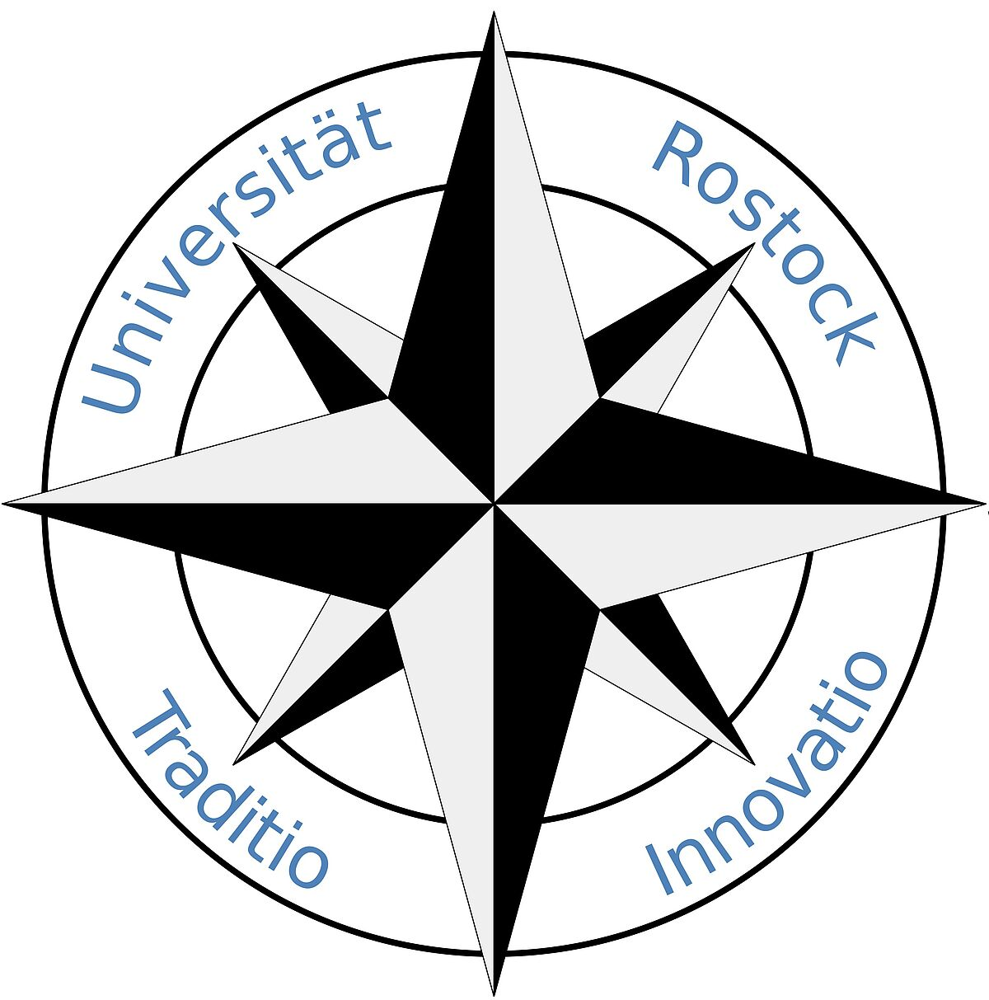

    

hrosailing - Sailing made in Rostock
====================================

You can see the documentation here [Documentation](https://hrosailing.github.io/hrosailing/ "hrosailing").

### Compatibility 

`hrosailing` is compatible with ... 

<!-- [ -->

<!-- [ -->

<!-- [ -->

### Installation

The recommended way to install `hrosailing` is with 
[pip](http://pypi.python.org/pypi/pip/):
    
    pip install hrosailing

<!-- [ -->
<!-- [ -->

### Examples

### Contributing 

### License 
